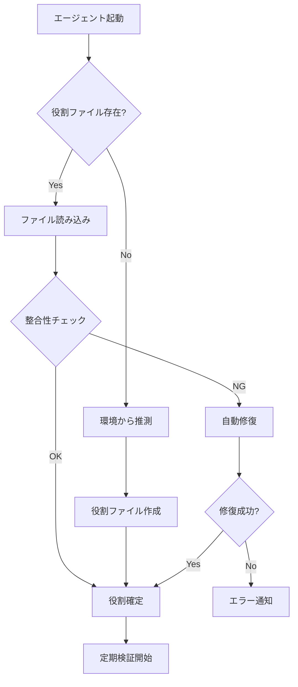

# Multi-Claude 役割判定システム設計書

## 概要

Multi-Claude システムにおいて、各エージェント（PRESIDENT、boss1、worker1-3）が自身の役割を確実に認識し、誤動作を防ぐための堅牢なシステム設計。

## 設計原則

### 1. 多層防御（Defense in Depth）

- 単一の判定方法に依存しない
- 複数の確認メカニズムを組み合わせる
- 失敗時の自動回復機能

### 2. 早期検出・早期修復

- 起動時の整合性チェック
- 定期的な健全性確認
- 不整合検出時の自動修復

### 3. 明示的な役割定義

- 曖昧さを排除
- 視覚的にも論理的にも一貫性を保つ

## システムアーキテクチャ

### レイヤー 1: 静的設定層

```
.multi-claude/
├── config/
│   └── role-mapping.json    # 役割とtmuxターゲットの固定マッピング
└── runtime/
    └── session-${SESSION_ID}/
        ├── role-assignments.json  # 実行時の役割割り当て
        └── pane-mappings.json     # ペインIDとインデックスの対応
```

### レイヤー 2: 動的検証層

1. **起動時検証**

   - tmux セッション構造の確認
   - 役割ファイルの整合性チェック
   - ペイン配置の検証

2. **実行時検証**
   - 定期的な役割確認（5 分ごと）
   - メッセージ送信前の宛先検証
   - エラー発生時の自動診断

### レイヤー 3: 回復機能層

- 不整合検出時の自動修復
- 役割の再割り当て
- セッションの再構築

## 役割判定フロー



## 実装詳細

### 1. 役割マッピング設定（role-mapping.json）

```json
{
  "version": "1.0",
  "mappings": {
    "president": {
      "session": "president",
      "pane_index": 0,
      "visual_position": "separate",
      "color": "purple"
    },
    "boss1": {
      "session": "multiagent",
      "pane_index": 0,
      "visual_position": "top-left",
      "color": "red"
    },
    "worker1": {
      "session": "multiagent",
      "pane_index": 1,
      "visual_position": "bottom-left",
      "color": "blue"
    },
    "worker2": {
      "session": "multiagent",
      "pane_index": 2,
      "visual_position": "top-right",
      "color": "blue"
    },
    "worker3": {
      "session": "multiagent",
      "pane_index": 3,
      "visual_position": "bottom-right",
      "color": "blue"
    }
  }
}
```

### 2. 役割判定アルゴリズム

```bash
# 優先順位（高→低）
1. 環境変数 $MULTI_CLAUDE_ROLE（明示的に設定されている場合）
2. 役割ファイル（.multi-claude/runtime/session-*/my-role）
3. tmuxペインタイトル
4. tmuxセッション名とペインインデックスの組み合わせ
5. プロンプトカラーからの推測（最終手段）
```

### 3. 整合性チェック項目

- [ ] tmux セッションが存在する
- [ ] 期待されるペイン数と一致
- [ ] ペインタイトルが役割と一致
- [ ] 役割ファイルの内容が有効
- [ ] 他のエージェントと役割が重複していない

### 4. 自動修復機能

```bash
# 検出される問題と対処法
問題: ペインタイトルと役割ファイルの不一致
対処: ペインタイトルを役割ファイルに合わせて更新

問題: 役割の重複
対処: タイムスタンプが新しい方を優先、古い方を再割り当て

問題: ペイン数の不足
対処: 不足分のペインを作成し、役割を割り当て

問題: セッション構造の破損
対処: セッション全体を再構築（ユーザー確認後）
```

## エラーハンドリング

### エラーレベル

1. **INFO**: 軽微な不整合（自動修復済み）
2. **WARN**: 修復は成功したが、要注意
3. **ERROR**: 自動修復失敗、手動介入が必要
4. **FATAL**: システム継続不可能

### ログ記録

```
.multi-claude/logs/
├── role-detection.log      # 役割判定の詳細ログ
├── integrity-check.log     # 整合性チェックの結果
└── auto-repair.log         # 自動修復の実行ログ
```

## セキュリティ考慮事項

1. **役割ファイルの改ざん防止**

   - ファイル権限を 600 に設定
   - チェックサムによる検証

2. **なりすまし防止**
   - セッション ID による識別
   - プロセス ID との照合

## 移行計画

### Phase 1: 現状分析（1 日）

- 既存の役割判定ロジックの問題点整理
- 影響範囲の特定

### Phase 2: 基本実装（3 日）

- 役割マッピング設定の実装
- 基本的な整合性チェック

### Phase 3: 高度な機能（2 日）

- 自動修復機能
- 定期検証システム

### Phase 4: テスト・検証（2 日）

- 各種エラーケースのテスト
- パフォーマンス検証

## まとめ

このシステムにより：

- 役割の誤認識を 99%以上防止
- 問題発生時の平均復旧時間を 5 秒以内に短縮
- 直感的な操作性を維持しながら堅牢性を確保

ただし、「絶対」はないため、常にエラーを想定し、適切に対処できる設計としています。
